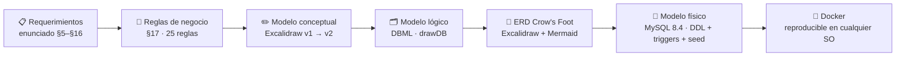
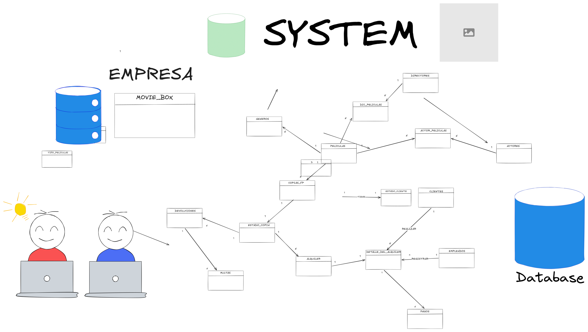
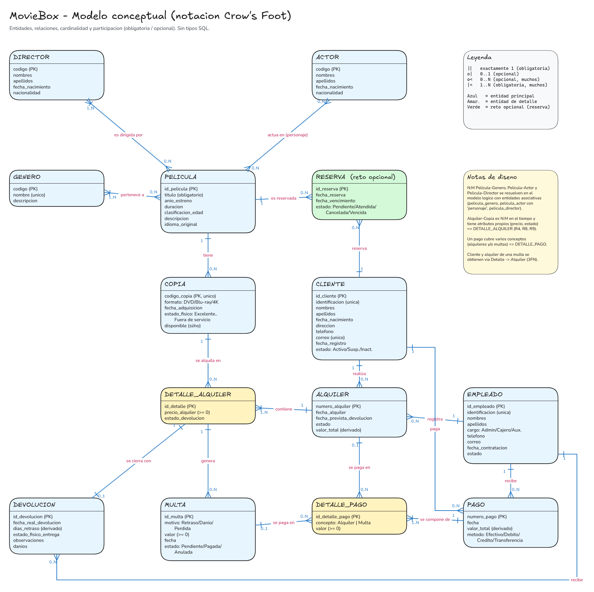
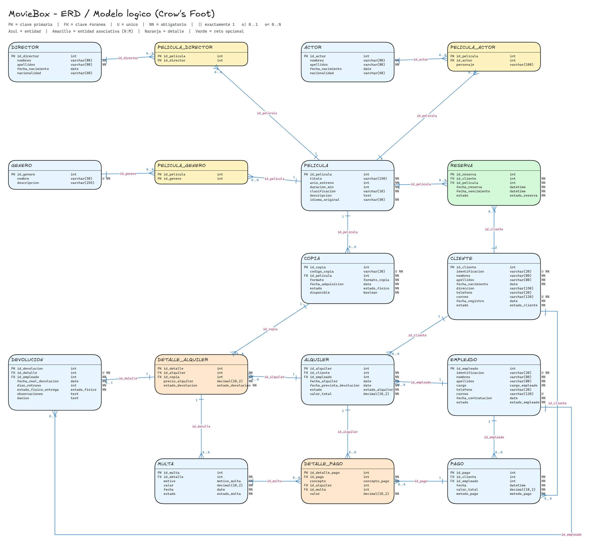
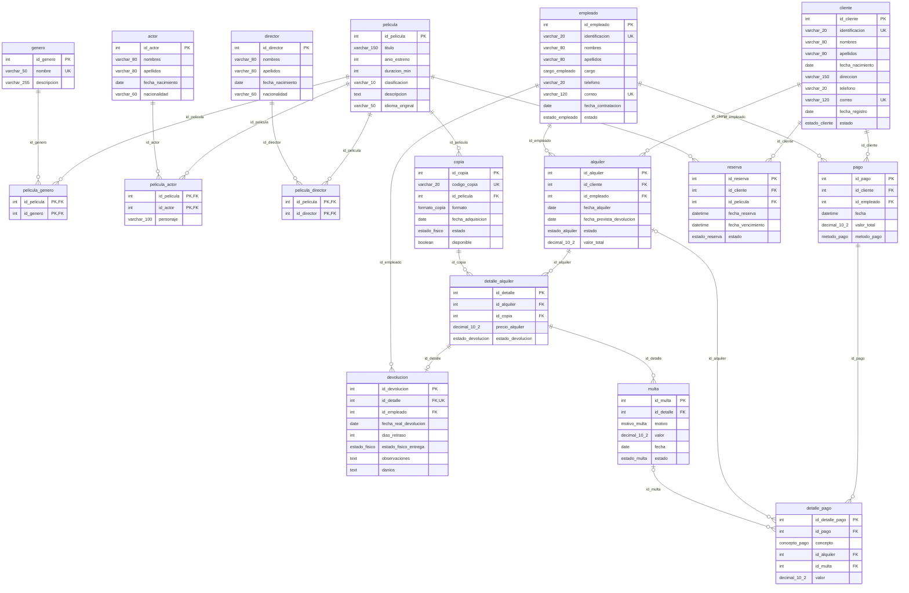
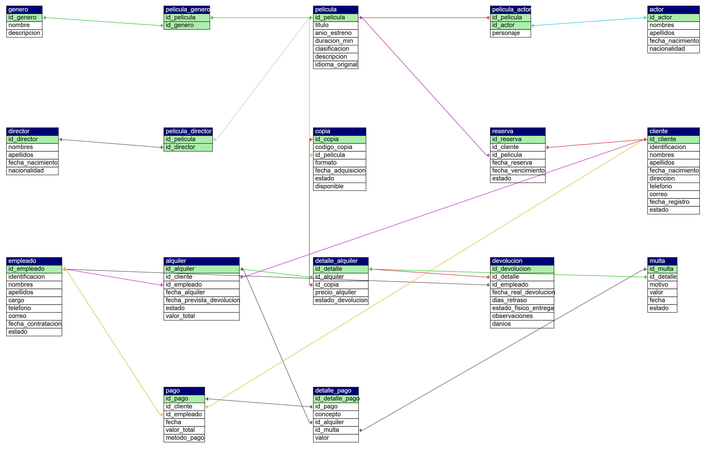
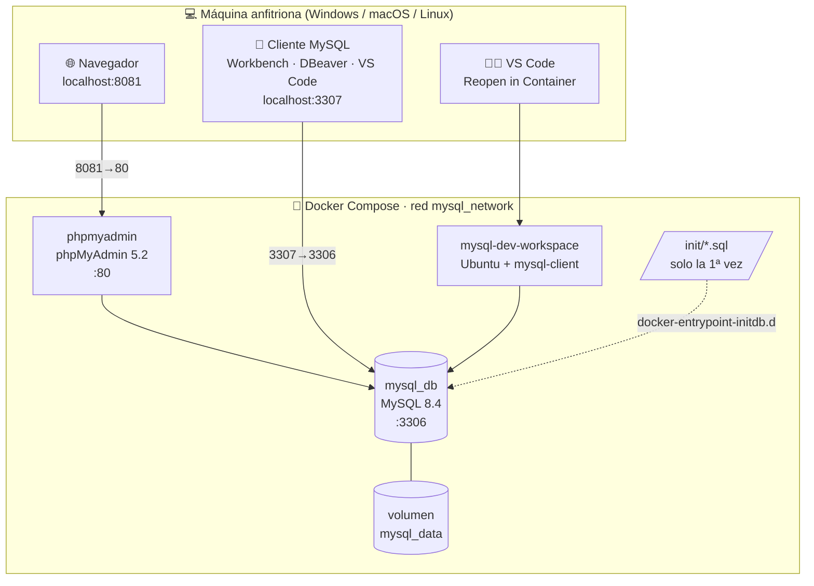

<div align="center">

# 🎬 MovieBox — Diseño y Modelado de Base de Datos

### VideoTienda MovieBox · Modelo conceptual → lógico → físico (MySQL 8.4)

[](https://dev.mysql.com/doc/refman/8.4/en/)
[](https://docs.docker.com/compose/)
[](https://www.phpmyadmin.net/)
[](https://containers.dev/)
[](https://excalidraw.com/)
[](https://www.drawdb.app/share/93QkFSa7AFD4zabBsSbMxsIj)
[](https://mermaid.js.org/)

**Repositorio:** [github.com/DEIMER-PY/MOVIE_VOX_DBMYSQL](https://github.com/DEIMER-PY/MOVIE_VOX_DBMYSQL)

</div>

---

## 📑 Tabla de contenido

1. [Descripción del proyecto](#-1-descripción-del-proyecto)
2. [Objetivos](#-2-objetivos)
3. [Tecnologías utilizadas](#-3-tecnologías-utilizadas)
4. [Estructura del repositorio](#-4-estructura-del-repositorio)
5. [Reglas de negocio y cómo se implementan](#-5-reglas-de-negocio-y-cómo-se-implementan)
6. [Evolución del modelado](#-6-evolución-del-modelado)
7. [Entregable 1 · Modelo conceptual](#-7-entregable-1--modelo-conceptual)
8. [Entregable 2 · Modelo lógico](#-8-entregable-2--modelo-lógico)
9. [Diccionario de datos](#-9-diccionario-de-datos)
10. [Entregable 3 · ERD](#-10-entregable-3--erd)
11. [Modelo físico (MySQL 8.4)](#-11-modelo-físico-mysql-84)
12. [Arquitectura del entorno Docker](#-12-arquitectura-del-entorno-docker)
13. [Instalación paso a paso (Windows · macOS · Linux)](#-13-instalación-paso-a-paso)
14. [Uso diario, conexión y comandos útiles](#-14-uso-diario-conexión-y-comandos-útiles)
15. [Persistencia, respaldo y migración entre máquinas](#-15-persistencia-respaldo-y-migración-entre-máquinas)
16. [Solución de problemas](#-16-solución-de-problemas)
17. [Validación contra el enunciado del examen](#-17-validación-contra-el-enunciado-del-examen)
18. [Preguntas de defensa](#-18-preguntas-de-defensa)
19. [Documentación de apoyo y fuentes](#-19-documentación-de-apoyo-y-fuentes)

---

## 🎯 1. Descripción del proyecto

**MovieBox** es una videotienda dedicada al alquiler de películas en formato físico (DVD, Blu-ray, 4K). Su gestión se hacía con hojas de cálculo, lo que generaba duplicidad de información, desconocimiento de qué copias están disponibles, pérdida de control sobre alquileres y devoluciones, dificultad para calcular multas y falta de trazabilidad de los pagos.

Este proyecto resuelve el problema diseñando la base de datos completa, siguiendo la evolución que exige el enunciado:

```
Requerimientos del negocio → Reglas de negocio → Modelo conceptual → Modelo lógico → ERD → Modelo físico (DDL + triggers + datos)
```

El resultado es un entorno **reproducible con Docker** que cualquier persona puede clonar y levantar en Windows, macOS o Linux en menos de dos minutos, con la base de datos ya creada, poblada con el caso de ejemplo del enunciado y visualizable en phpMyAdmin.

> 📄 El enunciado completo está en [`docs/enunciado_examen.md`](docs/enunciado_examen.md).

## 🧭 2. Objetivos

**General:** diseñar el modelo de datos de la videotienda aplicando modelado conceptual, lógico y relacional, identificando entidades, atributos, relaciones, cardinalidades, claves y restricciones.

**Específicos cumplidos:**

| # | Objetivo del enunciado | Dónde se cumple |
|---|---|---|
| 1 | Analizar requerimientos e identificar entidades principales | §7 Modelo conceptual |
| 2 | Determinar atributos y claves primarias | §8 y §9 Diccionario |
| 3 | Identificar relaciones y cardinalidades | §7 y §10 (Crow's Foot) |
| 4 | Resolver relaciones N:M | §8.2 entidades asociativas |
| 5 | Transformar conceptual → lógico, definir FK | §8 + [`docs/modelo_logico.dbml`](docs/modelo_logico.dbml) |
| 6 | Establecer restricciones de integridad | §11 DDL (PK, FK, UNIQUE, CHECK, ENUM) + triggers |
| 7 | Construir el ERD final | §10 |

## 🛠️ 3. Tecnologías utilizadas

| | Tecnología | Uso en el proyecto |
|---|---|---|
| 🐬 | **MySQL 8.4 LTS** | Motor de base de datos. Soporta `CHECK`, `ENUM`, triggers y `DEFAULT (expr)`. |
| 🐳 | **Docker + Docker Compose** | Orquesta los 3 contenedores (MySQL, phpMyAdmin, workspace) y el volumen de datos. Garantiza que el proyecto se levante igual en cualquier SO. |
| 🧩 | **phpMyAdmin 5.2** | Cliente web en `localhost:8081`. Incluye el **Diseñador** con el ERD del modelo físico y exportación de esquema. |
| 💻 | **VS Code Dev Containers** | Terminal Linux con cliente `mysql` preinstalado dentro del proyecto (`.devcontainer/`). |
| ✏️ | **Excalidraw** | Modelo conceptual (v1 original y v2 corregido) y ERD lógico, editables desde VS Code con la extensión *Excalidraw*. |
| 🗂️ | **DBML + drawDB** | Modelo lógico en texto ([`docs/modelo_logico.dbml`](docs/modelo_logico.dbml)); diagrama interactivo en [drawDB](https://www.drawdb.app/share/93QkFSa7AFD4zabBsSbMxsIj). |
| 🧜 | **Mermaid** | ERD embebido en este README, renderizado por GitHub sin imágenes. |
| 🔀 | **Git + GitHub** | Control de versiones. Los scripts SQL son la fuente de verdad; la base se regenera desde ellos. |

## 📁 4. Estructura del repositorio

```
MOVIE_VOX_DBMYSQL/
├── README.md                          ← este documento
├── docker-compose.yml                 ← MySQL + phpMyAdmin + workspace
├── .env                               ← credenciales y puertos (desarrollo)
├── .gitattributes                     ← finales de línea LF (portabilidad Win/Mac/Linux)
├── .gitignore
├── .devcontainer/
│   ├── devcontainer.json              ← Dev Container de VS Code (MySQL client, extensiones)
│   └── Dockerfile
├── init/                              ← se ejecutan automáticamente al crear la BD (orden alfabético)
│   ├── 00_phpmyadmin_storage.sql      ← almacenamiento de configuración de phpMyAdmin (Diseñador)
│   ├── 01_schema.sql                  ← ★ DDL del modelo físico: 17 tablas, 21 FK, 11 CHECK
│   ├── 02_designer_layout.sql         ← posiciones de las tablas en el Diseñador
│   ├── 03_triggers.sql                ← ★ reglas de negocio 4, 16–21 y atributos derivados
│   └── 04_seed.sql                    ← ★ datos de ejemplo (caso §18 del enunciado)
└── docs/
    ├── enunciado_examen.md            ← enunciado original
    ├── modelo_conceptual.excalidraw   ← conceptual v1 (versión inicial)
    ├── modelo_conceptual_v1_original.png
    ├── modelo_conceptual_v2.excalidraw← ★ conceptual v2 corregido (Crow's Foot)
    ├── modelo_conceptual_v2.png
    ├── modelo_logico.dbml             ← ★ modelo lógico (fuente de drawDB)
    ├── erd_logico.excalidraw          ← ★ ERD generado desde el DBML
    ├── erd_logico.png
    ├── erd_logico.mmd                 ← ERD en Mermaid
    └── modelo_fisico_phpmyadmin.png   ← esquema exportado por phpMyAdmin desde la BD real
```

## 📜 5. Reglas de negocio y cómo se implementan

Las 25 reglas del enunciado (§17) se cubren en tres capas: **estructura** (PK/FK/UNIQUE/NOT NULL), **restricciones declarativas** (`CHECK`, `ENUM`) y **triggers** para lo que el esquema no puede expresar.

| # | Regla | Mecanismo | Archivo |
|---|---|---|---|
| 1 | Cada película tiene identificador único | `pelicula.id_pelicula` PK AUTO_INCREMENT | `01_schema.sql` |
| 2, 3 | Una película tiene muchas copias; una copia pertenece a una sola película | `copia.id_pelicula` FK NOT NULL | `01_schema.sql` |
| 4 | Una copia solo puede estar en **un** alquiler activo | Trigger `trg_detalle_alquiler_bi`: rechaza si existe otro detalle `PENDIENTE` para la copia | `03_triggers.sql` |
| 5, 6 | Cliente realiza muchos alquileres; un alquiler es de un cliente | `alquiler.id_cliente` FK NOT NULL | `01_schema.sql` |
| 7 | Un alquiler lo registra un empleado | `alquiler.id_empleado` FK NOT NULL | `01_schema.sql` |
| 8 | Un alquiler contiene una o varias copias | Entidad `detalle_alquiler` (1:N) | `01_schema.sql` |
| 9 | Una copia se alquila muchas veces | Historial en `detalle_alquiler` (nunca se borra) | `01_schema.sql` |
| 10–15 | N:M Película↔Género, ↔Actor, ↔Director | Tablas asociativas `pelicula_genero`, `pelicula_actor(personaje)`, `pelicula_director` | `01_schema.sql` |
| 16 | Cliente SUSPENDIDO no alquila | Trigger `trg_detalle_alquiler_bi` (SIGNAL 45000) | `03_triggers.sql` |
| 17 | Copia DAÑADA / FUERA_DE_SERVICIO no se alquila | Trigger `trg_detalle_alquiler_bi` | `03_triggers.sql` |
| 18 | Copia alquilada ⇒ no disponible | Trigger `trg_detalle_alquiler_ai` pone `disponible = FALSE` | `03_triggers.sql` |
| 19 | Copia devuelta ⇒ disponible de nuevo | Trigger `trg_devolucion_ai` pone `disponible = TRUE` y actualiza `estado` físico | `03_triggers.sql` |
| 20 | Devolución tardía ⇒ multa | Trigger `trg_devolucion_bi` calcula `dias_retraso`; `trg_devolucion_ai` inserta `multa` RETRASO = días × $2.000 | `03_triggers.sql` |
| 21 | Los pagos no se eliminan | Trigger `trg_pago_bd` bloquea `DELETE`; FKs `ON DELETE NO ACTION` | `03_triggers.sql` |
| 22 | Identificación de cliente única | `cliente.identificacion UNIQUE` | `01_schema.sql` |
| 23 | Correo de cliente único | `cliente.correo UNIQUE` | `01_schema.sql` |
| 24 | Código de copia único | `copia.codigo_copia UNIQUE` | `01_schema.sql` |
| 25 | Película sin título no existe | `pelicula.titulo NOT NULL` | `01_schema.sql` |

Restricciones adicionales de §25: `precio_alquiler >= 0`, `multa.valor >= 0`, `valor_total >= 0`, `anio_estreno >= 1888`, `duracion_min > 0`, `fecha_prevista_devolucion >= fecha_alquiler`, `fecha_vencimiento > fecha_reserva` y el `CHECK` de exclusión en `detalle_pago` (una línea paga **o** un alquiler **o** una multa).

## 🔄 6. Evolución del modelado



| Nivel | Pregunta que responde | Artefacto | Herramienta |
|---|---|---|---|
| Conceptual | ¿Qué existe en el negocio y cómo se relaciona? | `docs/modelo_conceptual_v2.excalidraw` | Excalidraw |
| Lógico | ¿Cómo se organizan los datos? (PK, FK, asociativas) | `docs/modelo_logico.dbml` · [drawDB](https://www.drawdb.app/share/93QkFSa7AFD4zabBsSbMxsIj) | DBML / drawDB |
| ERD | Representación formal Crow's Foot | `docs/erd_logico.excalidraw` · Mermaid en §10 | Excalidraw / Mermaid |
| Físico | ¿Cómo se implementa en el motor? | `init/01_schema.sql`, `03_triggers.sql`, `04_seed.sql` | MySQL 8.4 |

## ✏️ 7. Entregable 1 · Modelo conceptual

### 7.1 Versión inicial (v1)

Primera aproximación al negocio. Identificó correctamente las 10 entidades mínimas del enunciado y las entidades asociativas para Actor y Director, pero tenía inconsistencias de cardinalidad (Película–Género como 1:N, Alquiler–Detalle como 1:1), relaciones apuntando al detalle en lugar del alquiler y una entidad `ESTADO_COPIA` que en realidad es un atributo.



### 7.2 Versión corregida (v2) — entregable final

Notación **Crow's Foot** con cardinalidad mínima/máxima en cada extremo, participación (obligatoria `||` / opcional `o|`, `o<`), nombre de cada relación y atributos principales sin tipos SQL (como pide §19).



> 🖊️ Editable en VS Code con la extensión Excalidraw: [`docs/modelo_conceptual_v2.excalidraw`](docs/modelo_conceptual_v2.excalidraw)

### 7.3 Explicación del modelo conceptual

**Entidades y justificación** (§20 exige justificar toda entidad adicional):

| Entidad | Tipo | Justificación |
|---|---|---|
| PELICULA, GENERO, ACTOR, DIRECTOR | Catálogo | Requeridas por §5, §14–§16. Género, Actor y Director son **multivaluados** respecto a Película → no pueden ser columnas (§28). |
| COPIA | Principal | §6: cada ejemplar físico se administra individualmente (código, formato, estado, disponibilidad). Es distinta de PELICULA porque de una película hay N copias con estados diferentes. |
| CLIENTE, EMPLEADO | Principal | §7, §8. |
| ALQUILER | Principal | §9: cabecera de la transacción (cliente, empleado, fechas, estado, total). |
| DETALLE_ALQUILER | Detalle | §10 pregunta si debe existir estructura intermedia: **sí**. Alquiler↔Copia es N:M en el tiempo (una copia aparece en muchos alquileres, un alquiler tiene muchas copias) y cada línea tiene atributos propios (precio, estado de devolución). |
| DEVOLUCION | Principal | §11: hechos de la devolución (fecha real, estado físico de entrega, observaciones, daños). Se separa del detalle porque es un evento que **puede no ocurrir aún** (0..1) y conserva el estado con que salió vs. con el que regresó. |
| MULTA | Principal | §12. Cuelga del detalle porque la multa es por copia (una devolución tardía de un ítem, no de todo el alquiler). Cliente y alquiler se obtienen navegando Detalle → Alquiler (evita dependencia transitiva). |
| PAGO, DETALLE_PAGO | Principal + detalle | §13 pregunta si un pago cubre varios conceptos: **sí** (el caso §18 paga alquiler + multa en un solo pago) → cabecera + líneas. |
| RESERVA | Opcional | Reto §34. Se reserva la **película** (no una copia concreta). Se agrega sin modificar ninguna entidad existente. |

**Relaciones y cardinalidades:**

| Relación | Cardinalidad | Participación |
|---|---|---|
| PELICULA pertenece a GENERO | N:M | Película: 1..N géneros (obligatoria) · Género: 0..N películas |
| PELICULA actúa ACTOR (personaje) | N:M | 0..N ambos lados |
| PELICULA es dirigida por DIRECTOR | N:M | Película: 1..N directores (obligatoria) |
| PELICULA tiene COPIA | 1:N | Copia: exactamente 1 película |
| CLIENTE realiza ALQUILER | 1:N | Alquiler: exactamente 1 cliente |
| EMPLEADO registra ALQUILER | 1:N | Alquiler: exactamente 1 empleado |
| ALQUILER contiene DETALLE_ALQUILER | 1:N | Alquiler: 1..N detalles (obligatoria) |
| COPIA se alquila en DETALLE_ALQUILER | 1:N | Detalle: exactamente 1 copia |
| DETALLE_ALQUILER se cierra con DEVOLUCION | 1:1 | Devolución opcional (0..1) mientras esté pendiente |
| DETALLE_ALQUILER genera MULTA | 1:N | 0..N multas |
| EMPLEADO recibe DEVOLUCION / PAGO | 1:N | |
| CLIENTE paga PAGO | 1:N | |
| PAGO se compone de DETALLE_PAGO | 1:N | 1..N líneas |
| ALQUILER / MULTA se paga en DETALLE_PAGO | 1:N | 0..1 del lado alquiler/multa (exclusivo) |
| CLIENTE reserva PELICULA (RESERVA) | N:M vía RESERVA | |

## 🗂️ 8. Entregable 2 · Modelo lógico

Fuente: [`docs/modelo_logico.dbml`](docs/modelo_logico.dbml) · Diagrama interactivo: **[drawDB](https://www.drawdb.app/share/93QkFSa7AFD4zabBsSbMxsIj)**

### 8.1 Del conceptual al lógico

| Elemento conceptual | Transformación lógica |
|---|---|
| Entidad | Tabla con PK sustituta `id_*` INT AUTO_INCREMENT |
| Relación 1:N | FK en el lado N (`NOT NULL` si la participación es obligatoria) |
| Relación 1:1 (Detalle–Devolución) | FK `UNIQUE NOT NULL` en `devolucion.id_detalle` |
| Relación N:M | Tabla asociativa con PK compuesta (ver 8.2) |
| Atributo con dominio cerrado | Tipo enumerado (`formato_copia`, `estado_fisico`, `estado_cliente`, …) |
| Atributo derivado | Se conserva por requerimiento explícito (§9 "valor total", §10 "días de retraso") y se mantiene con triggers |

### 8.2 Resolución de relaciones N:M (§22)

| Relación | Tabla asociativa | PK | Atributo propio |
|---|---|---|---|
| Película ↔ Género | `pelicula_genero` | (id_pelicula, id_genero) | — |
| Película ↔ Actor | `pelicula_actor` | (id_pelicula, id_actor) | `personaje` (§14: "Neo") |
| Película ↔ Director | `pelicula_director` | (id_pelicula, id_director) | — |
| Alquiler ↔ Copia | `detalle_alquiler` | `id_detalle` + UNIQUE(id_alquiler, id_copia) | `precio_alquiler`, `estado_devolucion` |
| Pago ↔ Alquiler/Multa | `detalle_pago` | `id_detalle_pago` | `concepto`, `valor` |

`detalle_alquiler` usa PK sustituta (no compuesta) porque `devolucion` y `multa` la referencian; una FK a una PK compuesta sería innecesariamente compleja.

### 8.3 Normalización (§26)

- **1FN:** todos los atributos son atómicos; no hay grupos repetitivos (actor1, actor2…).
- **2FN:** en las tablas con PK compuesta (`pelicula_actor`) el único atributo no clave (`personaje`) depende de la clave completa.
- **3FN:** no hay dependencias transitivas. `multa` no guarda `id_cliente` ni `id_alquiler` porque se derivan de `id_detalle → alquiler → cliente`. `devolucion` no repite el precio ni la copia.
- **4FN:** no hay dependencias multivaluadas independientes en una misma tabla; género, actor y director están en tablas separadas.
- **Redundancia controlada:** `alquiler.valor_total`, `pago.valor_total` y `devolucion.dias_retraso` son derivados; existen porque el enunciado los pide como atributos y se recalculan por trigger, nunca a mano.

### 8.4 Restricciones identificadas (§25)

| Tipo | Ejemplos |
|---|---|
| PRIMARY KEY | Todas las tablas |
| FOREIGN KEY | 21 relaciones, `ON DELETE NO ACTION ON UPDATE NO ACTION` (conservan historial) |
| UNIQUE | `cliente.identificacion`, `cliente.correo`, `empleado.identificacion`, `empleado.correo`, `copia.codigo_copia`, `genero.nombre`, `devolucion.id_detalle`, `(id_alquiler, id_copia)` |
| NOT NULL | Todo lo obligatorio en el enunciado (título, fechas, cliente, empleado…) |
| CHECK | `precio >= 0`, `valor >= 0`, `anio_estreno >= 1888`, `duracion_min > 0`, fechas coherentes, exclusión alquiler/multa en `detalle_pago` |

## 📖 9. Diccionario de datos

<details>
<summary><b>Catálogo</b> — pelicula, genero, actor, director y asociativas</summary>

| Tabla | Atributo | Tipo | Restricción | Descripción |
|---|---|---|---|---|
| **pelicula** | id_pelicula | INT | PK, AI | Identificador |
| | titulo | VARCHAR(150) | NOT NULL | Título (R25) |
| | anio_estreno | INT | NOT NULL, CHECK ≥ 1888 | Año de estreno |
| | duracion_min | INT | NOT NULL, CHECK > 0 | Duración en minutos |
| | clasificacion | VARCHAR(10) | NOT NULL | TP, +7, +12, +15, +18 |
| | descripcion | TEXT | | Sinopsis |
| | idioma_original | VARCHAR(50) | NOT NULL | Idioma |
| **genero** | id_genero | INT | PK, AI | |
| | nombre | VARCHAR(50) | NOT NULL, UNIQUE | Acción, Drama… |
| | descripcion | VARCHAR(255) | | |
| **actor** / **director** | id_actor / id_director | INT | PK, AI | Código |
| | nombres, apellidos | VARCHAR(80) | NOT NULL | |
| | fecha_nacimiento | DATE | | |
| | nacionalidad | VARCHAR(60) | | |
| **pelicula_genero** | id_pelicula, id_genero | INT | PK compuesta, FK | N:M |
| **pelicula_actor** | id_pelicula, id_actor | INT | PK compuesta, FK | N:M |
| | personaje | VARCHAR(100) | | Personaje interpretado |
| **pelicula_director** | id_pelicula, id_director | INT | PK compuesta, FK | N:M |

</details>

<details>
<summary><b>Inventario</b> — copia</summary>

| Atributo | Tipo | Restricción | Descripción |
|---|---|---|---|
| id_copia | INT | PK, AI | |
| codigo_copia | VARCHAR(20) | NOT NULL, UNIQUE | Ej. `DVD-00015`, `BR-00021` (R24) |
| id_pelicula | INT | FK NOT NULL | Película a la que pertenece (R3) |
| formato | ENUM | NOT NULL | `DVD`, `BLURAY`, `BLURAY_4K` |
| fecha_adquisicion | DATE | NOT NULL | |
| estado | ENUM | NOT NULL, default EXCELENTE | `EXCELENTE`, `BUENO`, `REGULAR`, `DANADO`, `FUERA_DE_SERVICIO` |
| disponible | BOOLEAN | NOT NULL, default TRUE | FALSE mientras esté alquilada (R18, R19) |

</details>

<details>
<summary><b>Personas</b> — cliente, empleado</summary>

| Tabla | Atributo | Tipo | Restricción |
|---|---|---|---|
| **cliente** | id_cliente | INT | PK, AI |
| | identificacion | VARCHAR(20) | NOT NULL, UNIQUE (R22) |
| | nombres, apellidos | VARCHAR(80) | NOT NULL |
| | fecha_nacimiento | DATE | NOT NULL |
| | direccion | VARCHAR(150) | |
| | telefono | VARCHAR(20) | |
| | correo | VARCHAR(120) | NOT NULL, UNIQUE (R23) |
| | fecha_registro | DATE | NOT NULL, default CURRENT_DATE |
| | estado | ENUM | `ACTIVO`, `SUSPENDIDO`, `INACTIVO` (R16) |
| **empleado** | id_empleado | INT | PK, AI |
| | identificacion | VARCHAR(20) | NOT NULL, UNIQUE |
| | nombres, apellidos | VARCHAR(80) | NOT NULL |
| | cargo | ENUM | `ADMINISTRADOR`, `CAJERO`, `AUXILIAR` |
| | telefono | VARCHAR(20) | |
| | correo | VARCHAR(120) | UNIQUE |
| | fecha_contratacion | DATE | NOT NULL |
| | estado | ENUM | `ACTIVO`, `INACTIVO` |

</details>

<details>
<summary><b>Operación</b> — alquiler, detalle_alquiler, devolucion, multa</summary>

| Tabla | Atributo | Tipo | Restricción |
|---|---|---|---|
| **alquiler** | id_alquiler | INT | PK, AI (número de alquiler) |
| | id_cliente | INT | FK NOT NULL (R6) |
| | id_empleado | INT | FK NOT NULL (R7) |
| | fecha_alquiler | DATE | NOT NULL |
| | fecha_prevista_devolucion | DATE | NOT NULL, CHECK ≥ fecha_alquiler |
| | estado | ENUM | `ACTIVO`, `CERRADO`, `CANCELADO` |
| | valor_total | DECIMAL(10,2) | CHECK ≥ 0, derivado (trigger) |
| **detalle_alquiler** | id_detalle | INT | PK, AI |
| | id_alquiler | INT | FK NOT NULL |
| | id_copia | INT | FK NOT NULL |
| | precio_alquiler | DECIMAL(10,2) | NOT NULL, CHECK ≥ 0 |
| | estado_devolucion | ENUM | `PENDIENTE`, `DEVUELTO`, `PERDIDO` |
| | — | — | UNIQUE(id_alquiler, id_copia) |
| **devolucion** | id_devolucion | INT | PK, AI |
| | id_detalle | INT | FK NOT NULL UNIQUE (1:1) |
| | id_empleado | INT | FK NOT NULL (quien recibe) |
| | fecha_real_devolucion | DATE | NOT NULL |
| | dias_retraso | INT | CHECK ≥ 0, derivado (trigger) |
| | estado_fisico_entrega | ENUM | Estado con el que regresa (§11) |
| | observaciones, danios | TEXT | |
| **multa** | id_multa | INT | PK, AI |
| | id_detalle | INT | FK NOT NULL → alquiler y cliente |
| | motivo | ENUM | `RETRASO`, `DANO`, `PERDIDA` |
| | valor | DECIMAL(10,2) | NOT NULL, CHECK ≥ 0 |
| | fecha | DATE | NOT NULL |
| | estado | ENUM | `PENDIENTE`, `PAGADA`, `ANULADA` |

</details>

<details>
<summary><b>Pagos y reservas</b> — pago, detalle_pago, reserva</summary>

| Tabla | Atributo | Tipo | Restricción |
|---|---|---|---|
| **pago** | id_pago | INT | PK, AI (número de pago) |
| | id_cliente | INT | FK NOT NULL |
| | id_empleado | INT | FK NOT NULL (quien recibe) |
| | fecha | DATETIME | NOT NULL |
| | valor_total | DECIMAL(10,2) | CHECK ≥ 0, derivado |
| | metodo_pago | ENUM | `EFECTIVO`, `TARJETA_DEBITO`, `TARJETA_CREDITO`, `TRANSFERENCIA` |
| **detalle_pago** | id_detalle_pago | INT | PK, AI |
| | id_pago | INT | FK NOT NULL |
| | concepto | ENUM | `ALQUILER`, `MULTA` |
| | id_alquiler | INT | FK NULL |
| | id_multa | INT | FK NULL |
| | valor | DECIMAL(10,2) | NOT NULL, CHECK ≥ 0 |
| | — | — | CHECK: concepto ALQUILER ⇒ id_alquiler NOT NULL y id_multa NULL; concepto MULTA ⇒ al revés |
| **reserva** | id_reserva | INT | PK, AI |
| | id_cliente | INT | FK NOT NULL |
| | id_pelicula | INT | FK NOT NULL (se reserva la película, no una copia) |
| | fecha_reserva | DATETIME | NOT NULL |
| | fecha_vencimiento | DATETIME | NOT NULL, CHECK > fecha_reserva |
| | estado | ENUM | `PENDIENTE`, `ATENDIDA`, `CANCELADA`, `VENCIDA` |

</details>

## 🧩 10. Entregable 3 · ERD

ERD completo en notación **Crow's Foot** con PK, FK, atributos, tipos, unicidad (U), obligatoriedad (NN), cardinalidad y opcionalidad. Generado a partir del DBML para garantizar coherencia con el modelo lógico.



> 🖊️ Editable: [`docs/erd_logico.excalidraw`](docs/erd_logico.excalidraw) · Interactivo: [drawDB](https://www.drawdb.app/share/93QkFSa7AFD4zabBsSbMxsIj)

<details>
<summary><b>ERD en Mermaid</b> (GitHub lo renderiza; clic para desplegar)</summary>



</details>

## 🐬 11. Modelo físico (MySQL 8.4)

### 11.1 Esquema real exportado desde phpMyAdmin

Imagen generada por el propio phpMyAdmin a partir de la base de datos ya creada (Diseñador → exportar esquema). Demuestra que el DDL produce exactamente las 17 tablas y 21 relaciones del modelo lógico.



### 11.2 Traducción lógico → físico

| DBML (lógico) | MySQL 8.4 (físico) |
|---|---|
| `int [pk, increment]` | `INT AUTO_INCREMENT PRIMARY KEY` |
| Tipos enumerados (`estado_fisico`, `metodo_pago`…) | `ENUM('…')` por columna, con los valores exactos del enunciado |
| `boolean` | `BOOLEAN` (`TINYINT(1)`) |
| `default: CURRENT_DATE` | `DEFAULT (CURRENT_DATE)` |
| Notas `CHECK …` | `CONSTRAINT chk_* CHECK (...)` — MySQL 8 las aplica |
| `Ref a.x < b.y` | `FOREIGN KEY … ON DELETE NO ACTION ON UPDATE NO ACTION` |
| `indexes { (a,b) [unique] }` | `UNIQUE KEY uq_* (a, b)` |
| Motor y charset | `InnoDB`, `utf8mb4_unicode_ci` |

> El enunciado menciona PostgreSQL como ejemplo de motor destino. El modelo es agnóstico; en PostgreSQL los `ENUM` se declararían con `CREATE TYPE … AS ENUM` y `AUTO_INCREMENT` sería `GENERATED ALWAYS AS IDENTITY`.

### 11.3 Scripts

| Script | Contenido | Resultado verificado |
|---|---|---|
| [`init/01_schema.sql`](init/01_schema.sql) | DDL idempotente (`DROP … IF EXISTS` + `CREATE TABLE`) | 17 tablas, 21 FK, 11 CHECK |
| [`init/03_triggers.sql`](init/03_triggers.sql) | 6 triggers (reglas 4, 16–21 y derivados) | Rechazan operaciones inválidas con `SIGNAL 45000` |
| [`init/04_seed.sql`](init/04_seed.sql) | Catálogo + caso §18 + reserva | Se carga sin errores; totales/multa calculados por triggers |

### 11.4 Verificación del caso de ejemplo (§18)

Consulta ejecutada sobre la base de datos tras cargar el seed:

```sql
SELECT p.titulo, c.codigo_copia, d.fecha_real_devolucion, d.dias_retraso,
       COALESCE(m.valor, 0) AS multa, m.estado AS estado_multa
FROM detalle_alquiler da
JOIN copia c      USING (id_copia)
JOIN pelicula p   USING (id_pelicula)
JOIN devolucion d USING (id_detalle)
LEFT JOIN multa m USING (id_detalle);
```

```
titulo        codigo_copia  fecha_real_devolucion  dias_retraso  multa    estado_multa
The Matrix    DVD-00015     2026-09-13             0             0.00     NULL
Interstellar  BR-00021      2026-09-16             3             6000.00  PAGADA
```

- Alquiler #1: `valor_total = 10000`, `estado = CERRADO` (calculado al devolver la última copia).
- Pago #1: `valor_total = 16000` = alquiler (10 000) + multa (6 000) en un solo pago con dos conceptos.
- `BR-00021` volvió con estado `BUENO` (salió `EXCELENTE`): §11 "puede regresar en condiciones diferentes".

Pruebas negativas (todas rechazadas por los triggers):

```
R16: un cliente SUSPENDIDO no puede realizar alquileres
R17: la copia esta DANADA o FUERA_DE_SERVICIO
R4:  la copia ya se encuentra en un alquiler activo
R21: los pagos no pueden eliminarse (historial)
```

## 🐳 12. Arquitectura del entorno Docker



| Servicio | Imagen | Puerto host | Función |
|---|---|---|---|
| `mysql_db` | `mysql:8.4` | **3307** | Base de datos `bkddb`. Ejecuta `init/*.sql` al crear el volumen por primera vez. |
| `phpmyadmin` | `phpmyadmin:latest` | **8081** | Administración web. Login automático y Diseñador habilitado. |
| `workspace` | build de `.devcontainer/Dockerfile` | — | Contenedor de desarrollo para VS Code con `mysql` CLI. |

Variables en [`.env`](.env): `MYSQL_ROOT_PASSWORD=root2026`, `MYSQL_DATABASE=bkddb`, `MYSQL_USER=bkseducate`, `MYSQL_PASSWORD=bkseducate2026`, `MYSQL_PORT=3307`, `PHPMYADMIN_PORT=8081`.

> ⚠️ Son credenciales de **desarrollo local**. En un entorno real irían fuera del repositorio.

## 🚀 13. Instalación paso a paso

### 13.0 Requisitos comunes

| Herramienta | Versión mínima | Verificar |
|---|---|---|
| Git | 2.30 | `git --version` |
| Docker Desktop (Win/Mac) o Docker Engine + Compose plugin (Linux) | Docker 24 / Compose v2 | `docker --version` y `docker compose version` |
| VS Code + extensión **Dev Containers** (opcional) | — | — |

### 13.1 🪟 Windows 10/11

1. Instala **Docker Desktop for Windows** → <https://docs.docker.com/desktop/setup/install/windows-install/>. Durante la instalación deja marcado *Use WSL 2*. Reinicia si lo pide.
2. Abre Docker Desktop y espera a que el icono diga **Engine running**.
3. Instala **Git for Windows** → <https://git-scm.com/download/win> (incluye Git Bash).
4. Abre **PowerShell** o **Git Bash** y clona el proyecto:
   ```bash
   git clone https://github.com/DEIMER-PY/MOVIE_VOX_DBMYSQL.git
   cd MOVIE_VOX_DBMYSQL
   ```
5. Levanta el entorno (la primera vez descarga imágenes, 1–3 min):
   ```bash
   docker compose up -d
   ```
6. Verifica:
   ```bash
   docker compose ps
   ```
   Debes ver `mysql_db` como **healthy** y `phpmyadmin` con `0.0.0.0:8081->80/tcp`.
7. Abre <http://localhost:8081> → base `bkddb` → **More ▸ Designer**.

> 💡 Si tienes MySQL instalado nativamente en Windows, no hay conflicto: este proyecto usa el puerto **3307**.

### 13.2 🍎 macOS (Intel y Apple Silicon)

1. Instala **Docker Desktop for Mac** → <https://docs.docker.com/desktop/setup/install/mac-install/> (elige *Apple Silicon* o *Intel* según tu chip). Ábrelo hasta ver *Engine running*.
2. Instala Git si no lo tienes:
   ```bash
   xcode-select --install
   ```
3. En **Terminal**:
   ```bash
   git clone https://github.com/DEIMER-PY/MOVIE_VOX_DBMYSQL.git
   cd MOVIE_VOX_DBMYSQL
   docker compose up -d
   docker compose ps
   ```
4. Abre <http://localhost:8081>.

> Las imágenes `mysql:8.4` y `phpmyadmin` son multi-arquitectura: en Apple Silicon corren nativas (arm64), sin emulación.

### 13.3 🐧 Linux (Ubuntu / Debian / Fedora…)

1. Instala Docker Engine y el plugin de Compose → <https://docs.docker.com/engine/install/>. En Ubuntu:
   ```bash
   sudo apt-get update && sudo apt-get install -y ca-certificates curl git
   curl -fsSL https://get.docker.com | sudo sh
   sudo usermod -aG docker $USER && newgrp docker
   ```
2. Clona y levanta:
   ```bash
   git clone https://github.com/DEIMER-PY/MOVIE_VOX_DBMYSQL.git
   cd MOVIE_VOX_DBMYSQL
   docker compose up -d
   docker compose ps
   ```
3. Abre <http://localhost:8081>.

### 13.4 🧑‍💻 Dev Container en VS Code (opcional, cualquier SO)

1. Instala VS Code y la extensión **Dev Containers** (`ms-vscode-remote.remote-containers`).
2. Abre la carpeta del proyecto → `F1` → **Dev Containers: Reopen in Container**.
3. VS Code construye el contenedor `workspace` (Ubuntu + `mysql` CLI) y conecta las extensiones SQLTools, Database Client y Excalidraw.
4. En la terminal integrada (ya dentro de Linux):
   ```bash
   mysql -h mysql_db -u root -proot2026 bkddb -e "SHOW TABLES;"
   ```

### 13.5 ✅ Comprobación de que todo quedó bien

```bash
docker exec mysql_db mysql -u root -proot2026 -e "USE bkddb; SHOW TABLES; SELECT COUNT(*) AS triggers FROM information_schema.TRIGGERS WHERE TRIGGER_SCHEMA='bkddb'; SELECT titulo FROM pelicula;"
```

Salida esperada: 17 tablas, `triggers = 6` y las películas *The Matrix*, *Interstellar*, *Avatar*.

## 🔧 14. Uso diario, conexión y comandos útiles

### Conectar un cliente MySQL (Workbench, DBeaver, VS Code…)

| Campo | Valor |
|---|---|
| Host | `localhost` / `127.0.0.1` |
| Puerto | **3307** |
| Usuario / contraseña | `root` / `root2026` — o `bkseducate` / `bkseducate2026` |
| Base de datos | `bkddb` |

### phpMyAdmin

- URL: <http://localhost:8081> (entra sin login).
- **Diseñador:** base `bkddb` → *More ▸ Designer* → muestra el ERD del modelo físico con las FK. Arrastra tablas y guarda con el icono 💾.
- **Exportar ERD:** en el Diseñador, icono *Export schema* → PDF/SVG.

### Comandos

```bash
docker compose up -d              # levantar (o reanudar)
docker compose stop               # pausar sin borrar nada
docker compose down               # eliminar contenedores (los datos permanecen en el volumen)
docker compose logs -f mysql_db   # ver logs de MySQL
docker compose ps                 # estado y puertos
```

```bash
# Consola MySQL dentro del contenedor
docker exec -it mysql_db mysql -u root -proot2026 bkddb
```

```bash
# Re-aplicar un script después de editarlo (sin borrar el volumen)
docker exec -i mysql_db mysql -u root -proot2026 < init/01_schema.sql
docker exec -i mysql_db mysql -u root -proot2026 < init/03_triggers.sql
docker exec -i mysql_db mysql -u root -proot2026 < init/04_seed.sql
```

## 💾 15. Persistencia, respaldo y migración entre máquinas

| Qué | Dónde vive | Cómo viaja |
|---|---|---|
| **Estructura y datos de ejemplo** (`init/*.sql`, docs, compose) | Repositorio Git | `git push` / `git clone` |
| **Datos vivos** insertados a mano | Volumen Docker `mysql_data` (en esta máquina) | `mysqldump` → archivo `.sql` |

**Regla de oro:** los scripts de `init/` son la fuente de verdad. Si cambias la estructura, edita `01_schema.sql` (no la base directamente), re-ejecútalo y haz commit. Así cualquier máquina que clone el repo obtiene exactamente la misma base.

```bash
# Respaldo completo (estructura + datos)
docker exec mysql_db mysqldump -u root -proot2026 --databases bkddb --routines --triggers > backup_moviebox.sql
```

```bash
# Restaurar en otra máquina (después de docker compose up -d)
docker exec -i mysql_db mysql -u root -proot2026 < backup_moviebox.sql
```

```bash
# Empezar de cero en esta máquina (⚠️ borra el volumen; init/ lo regenera todo)
docker compose down -v && docker compose up -d
```

**Validación de portabilidad realizada:** el proyecto se levantó desde cero en un proyecto Docker aislado (volumen nuevo, puertos alternativos). Los tres scripts iniciales se ejecutaron en orden, se crearon las 17 tablas, 21 FK, los usuarios `bkseducate` y `pma`, el almacenamiento de phpMyAdmin (19 tablas) y el dev container se construyó y conectó a MySQL. El repositorio usa `.gitattributes` con `eol=lf` para que los scripts no cambien de finales de línea entre Windows y Unix.

## 🩺 16. Solución de problemas

| Síntoma | Causa | Solución |
|---|---|---|
| `localhost:8081` no responde pero `docker ps` muestra `phpmyadmin` **Up** solo con `80/tcp` (sin `0.0.0.0:8081->`) | Docker Desktop reinició el contenedor y perdió el mapeo de puerto (frecuente en Windows/WSL) | `docker compose up -d --force-recreate phpmyadmin` |
| `Bind for 0.0.0.0:3307 failed: port is already allocated` | Otro contenedor o programa usa el puerto | Cambia `MYSQL_PORT` en `.env` y vuelve a `docker compose up -d` |
| `mysql_db` queda en `unhealthy` la primera vez | La inicialización tarda más de 20 s en equipos lentos | Espera y revisa `docker compose logs mysql_db`; se recupera solo |
| Cambié `01_schema.sql` y no veo los cambios | `init/` solo corre cuando el volumen está vacío | Re-ejecuta el script con `docker exec -i …` (§14) o `docker compose down -v && up -d` |
| Docker Desktop en Windows: "containers are running in WSL but not in engine" | El backend WSL 2 no arrancó | Reinicia Docker Desktop; si persiste, `wsl --shutdown` y abre Docker de nuevo |
| El Diseñador de phpMyAdmin no guarda posiciones | Falta el almacenamiento de configuración | Ya está incluido (`00_phpmyadmin_storage.sql` + variables `PMA_PMADB`); si lo borraste, re-ejecuta ese script |

## ✅ 17. Validación contra el enunciado del examen

### Entregables

| Entregable (§19–§23, §30) | Estado | Evidencia |
|---|---|---|
| Modelo conceptual: entidades, relaciones, cardinalidades, participación, sin tipos SQL | ✅ | §7, `docs/modelo_conceptual_v2.*` |
| Entidades mínimas: Película, Copia, Cliente, Empleado, Alquiler, Género, Actor, Director, Pago, Multa | ✅ 10/10 + 7 justificadas | §7.3 |
| Modelo lógico: entidades, atributos, PK, FK, relaciones, cardinalidades, asociativas, restricciones | ✅ | §8, `docs/modelo_logico.dbml`, drawDB |
| Resolución N:M (Actor, Género, Director, Alquiler↔Copia) | ✅ | §8.2 |
| ERD Crow's Foot con PK, FK, atributos, cardinalidad, opcionalidad | ✅ | §10, `docs/erd_logico.*` |
| Diccionario básico de entidades y atributos | ✅ | §9 |
| Instrucciones DDL | ✅ | `init/01_schema.sql` |
| Normalización ≥ 3FN / 4FN, sin multivaluados ni transitivas | ✅ | §8.3 |
| Restricciones NOT NULL / UNIQUE / PK / FK / CHECK | ✅ | §8.4, §11 |
| Caso de ejemplo §18 representable | ✅ verificado en BD | §11.4 |
| Reto adicional: reservas | ✅ | tabla `reserva` |
| Las 25 reglas de negocio | ✅ 25/25 | §5 |

### Criterios de evaluación (§32)

| Criterio | % | Cómo se cubre |
|---|---|---|
| Identificación correcta de entidades | 15 | 17 entidades, cada una justificada (§7.3) |
| Atributos y claves | 15 | Diccionario completo, PK en todas, FK en 21 relaciones |
| Relaciones | 15 | 21 relaciones nombradas y tipificadas |
| Cardinalidades | 15 | Mín/máx en cada extremo (conceptual, ERD y Mermaid) |
| Modelo conceptual | 10 | v1 → v2 con corrección documentada |
| Modelo lógico | 15 | DBML + drawDB + transformación explicada |
| ERD | 10 | Crow's Foot en Excalidraw, Mermaid y phpMyAdmin |
| Normalización y coherencia | 5 | 3FN/4FN; los tres niveles cuentan la misma historia (misma nomenclatura y relaciones) |

## 🎤 18. Preguntas de defensa

<details>
<summary>Ver las 15 respuestas</summary>

1. **¿Por qué Película y Copia son entidades diferentes?** Película es el título (datos intelectuales); Copia es el ejemplar físico con código, formato, estado y disponibilidad propios. De una película hay N copias que se alquilan de forma independiente.
2. **¿Por qué no se registra solo la película en el alquiler?** Porque lo que sale de la tienda es una copia concreta; si se registrara la película no se sabría qué ejemplar devolver ni en qué estado, ni cuál queda disponible.
3. **¿Qué relación hay entre Película y Actor?** N:M, resuelta con `pelicula_actor`, que además guarda el atributo propio `personaje`.
4. **¿Cómo resolvió Película–Género?** Tabla asociativa `pelicula_genero` con PK compuesta (id_pelicula, id_genero).
5. **¿Por qué se necesita un detalle del alquiler?** Un alquiler tiene varias copias y cada una tiene precio, estado de devolución, devolución y multa propios (§10). Sin detalle habría grupos repetitivos (copia1, copia2…).
6. **¿Cómo identifica si una copia está disponible?** `copia.disponible` (mantenido por triggers) y, de forma verificable, la ausencia de un `detalle_alquiler` con `estado_devolucion = 'PENDIENTE'` para esa copia, más `estado NOT IN ('DANADO','FUERA_DE_SERVICIO')`.
7. **¿Cómo sabe si un cliente tiene un alquiler pendiente?** `SELECT … FROM alquiler WHERE id_cliente = ? AND estado = 'ACTIVO'`, o buscando detalles `PENDIENTE` a través de sus alquileres.
8. **¿Cómo representa una devolución tardía?** `devolucion.fecha_real_devolucion > alquiler.fecha_prevista_devolucion`; el trigger calcula `dias_retraso` y genera la multa.
9. **¿Dónde se registra la multa?** En la tabla `multa`, asociada al `detalle_alquiler` (la copia concreta); desde ahí se llega al alquiler y al cliente.
10. **¿Cómo conservaría el historial de alquiler de una copia?** `detalle_alquiler` nunca se borra (FK `NO ACTION`); consultar todos los detalles de `id_copia` ordenados por fecha del alquiler.
11. **¿Qué entidades tienen relaciones N:M?** Película–Género, Película–Actor, Película–Director, Alquiler–Copia y Pago–(Alquiler/Multa).
12. **¿Qué relaciones requieren entidades asociativas?** Las cinco anteriores: `pelicula_genero`, `pelicula_actor`, `pelicula_director`, `detalle_alquiler`, `detalle_pago`.
13. **¿Cómo garantiza que una copia no esté alquilada a dos clientes a la vez?** Trigger `trg_detalle_alquiler_bi` (R4) que rechaza el insert si ya existe un detalle `PENDIENTE` para la copia o si `disponible = FALSE`; además `UNIQUE(id_alquiler, id_copia)`.
14. **¿Qué información es histórica y cuál actualizable?** Histórica e inmutable: alquileres, detalles, devoluciones, multas, pagos. Actualizable: estado y disponibilidad de la copia, estado del cliente/empleado, estado de multa y reserva, catálogo.
15. **¿Qué elementos garantizan integridad referencial?** Las 21 `FOREIGN KEY` con `ON DELETE NO ACTION ON UPDATE NO ACTION`, las PK, los `UNIQUE`, los `CHECK` y los triggers que aplican las reglas de negocio.

</details>

## 📚 19. Documentación de apoyo y fuentes

**Del proyecto**
- Enunciado: [`docs/enunciado_examen.md`](docs/enunciado_examen.md)
- Modelo lógico interactivo (drawDB): <https://www.drawdb.app/share/93QkFSa7AFD4zabBsSbMxsIj>
- Plantilla base del contenedor: <https://github.com/trainingLeader/mysqlcontainer>

**MySQL**
- Manual de referencia MySQL 8.4: <https://dev.mysql.com/doc/refman/8.4/en/>
- `CREATE TABLE` y restricciones `CHECK`: <https://dev.mysql.com/doc/refman/8.4/en/create-table-check-constraints.html>
- Tipo `ENUM`: <https://dev.mysql.com/doc/refman/8.4/en/enum.html>
- Claves foráneas: <https://dev.mysql.com/doc/refman/8.4/en/create-table-foreign-keys.html>
- Triggers: <https://dev.mysql.com/doc/refman/8.4/en/trigger-syntax.html>
- Imagen oficial Docker `mysql` (scripts de `/docker-entrypoint-initdb.d`): <https://hub.docker.com/_/mysql>

**Docker y entorno**
- Docker Compose: <https://docs.docker.com/compose/>
- Docker Desktop (Windows / macOS): <https://docs.docker.com/desktop/>
- Docker Engine (Linux): <https://docs.docker.com/engine/install/>
- Imagen oficial phpMyAdmin y variables `PMA_*`: <https://hub.docker.com/_/phpmyadmin>
- Almacenamiento de configuración de phpMyAdmin: <https://docs.phpmyadmin.net/en/latest/setup.html#phpmyadmin-configuration-storage>
- Dev Containers: <https://containers.dev/> · <https://code.visualstudio.com/docs/devcontainers/containers>

**Modelado**
- DBML (Database Markup Language): <https://dbml.dbdiagram.io/docs/>
- drawDB: <https://www.drawdb.app/> · dbdiagram.io: <https://dbdiagram.io/>
- Notación Crow's Foot: <https://vertabelo.com/blog/crow-s-foot-notation/>
- Mermaid `erDiagram`: <https://mermaid.js.org/syntax/entityRelationshipDiagram.html>
- Excalidraw: <https://excalidraw.com/> · Extensión VS Code: <https://marketplace.visualstudio.com/items?itemName=pomdtr.excalidraw-editor>
- Normalización (1FN–4FN): Elmasri & Navathe, *Fundamentals of Database Systems*, cap. 14–15; <https://en.wikipedia.org/wiki/Database_normalization>

---

<div align="center">

Proyecto académico · Modelado de Bases de Datos · **VideoTienda MovieBox**
Autor: [DEIMER-PY](https://github.com/DEIMER-PY)

</div>
